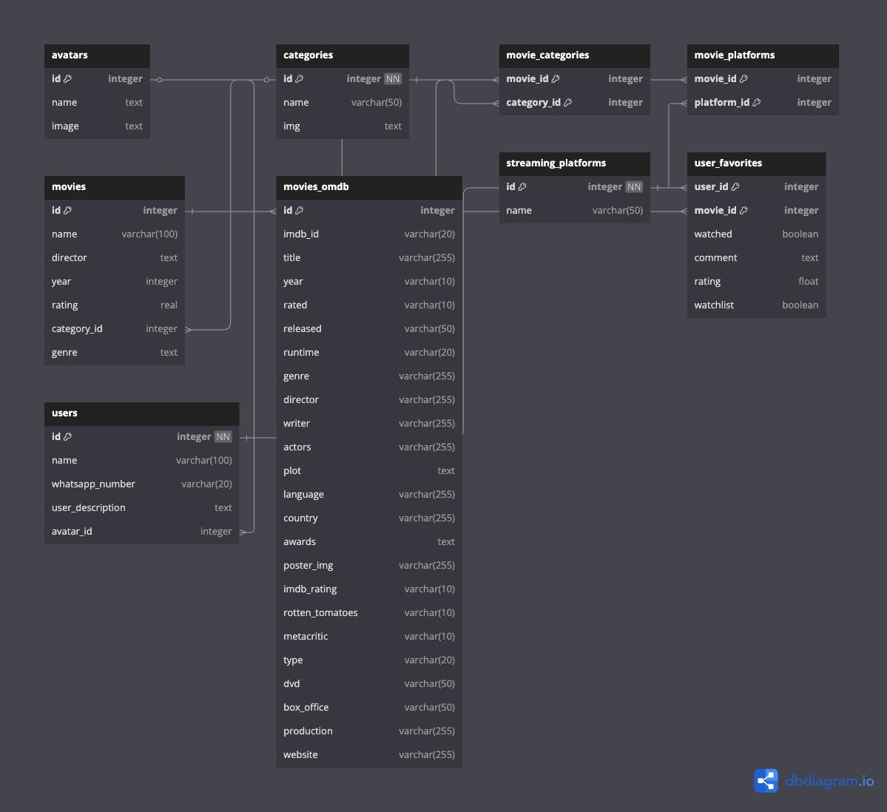

# SenFlix

SenFlix is a web-based movie management application built with Flask and SQLAlchemy. It allows users to browse, rate, and share movies, as well as create personal profiles and favorite lists.

## Table of Contents
- [Features](#features)
- [Tech Stack](#tech-stack)
- [Installation](#installation)
- [Project Structure](#project-structure)
- [Database Schema](#database-schema)
- [Core Components](#core-components)
- [API Endpoints](#api-endpoints)
- [Main Routes](#main-routes)

## Features
- User profiles with avatars
- Movie browsing by category and platform
- Personal watchlists and favorites
- Movie ratings and comments
- Movie recommendations based on user preferences
- OMDB API integration for movie metadata
- Responsive UI for all devices

## Tech Stack
- **Python 3.8+**
- **Flask** - Web framework
- **Flask-SQLAlchemy** - ORM for database access
- **Flask-Login** - User session management
- **SQLite** - Database
- **Jinja2** - HTML templating
- **OMDB API** - External movie data source
- **HTML/CSS/JavaScript** - Frontend

## Installation
1. **Clone the repository:**
   ```bash
   git clone https://github.com/yourusername/senflix.git
   cd senflix
   ```
2. **Create a virtual environment:**
   ```bash
   python -m venv venv
   source venv/bin/activate  # On Windows: venv\Scripts\activate
   ```
3. **Install dependencies:**
   ```bash
   pip install -r requirements.txt
   ```
4. **Set up environment variables:**
   Create a `.env` file with:
   ```
   SECRET_KEY=your_secret_key
   OMDB_API_KEY=your_omdb_api_key
   ```
5. **Run the application:**
   ```bash
   flask run
   # Or
   python wsgi.py
   ```
6. **Access the application:**
   Open your browser and go to http://localhost:5000

## Project Structure
```
SenFlix/
├── app.py                 # Main Flask application
├── wsgi.py                # WSGI entry point for production
├── requirements.txt       # Python dependencies
├── data/
│   ├── senflix.sqlite     # SQLite database
│   └── db_schema.png      # Database schema diagram
├── datamanager/
│   ├── __init__.py        # Package initialization
│   ├── interface.py       # Database models and interfaces
│   ├── db_manager.py      # Database operations implementation
│   └── omdb_manager.py    # OMDB API client
├── static/
│   ├── css/               # Stylesheets
│   ├── js/                # JavaScript
│   ├── avatars/           # User avatar images
│   └── movies/            # Movie poster images
├── templates/
│   ├── base.html          # Base template
│   ├── movies.html        # Movie listing page
│   ├── movie_detail.html  # Single movie view
│   └── ...                # Other templates
└── tests/                 # Test suite
```

## Database Schema

The database uses SQLAlchemy ORM with the following entity relationships:



### Core Entities:

#### User
- Represents application users
- Has avatar, favorites, and ratings relationships

#### Movie
- Represents movies in the system
- Related to categories, platforms, user favorites, and ratings

#### UserFavorite
- Junction table between User and Movie
- Stores watched status, watchlist, favorite, rating, and comments

#### Category
- Represents movie genres/categories
- Many-to-many relationship with movies

#### StreamingPlatform
- Represents streaming providers
- Many-to-many relationship with movies

#### MovieOMDB
- Stores external movie data from OMDB API
- One-to-one relationship with Movie

## Core Components

### Data Manager
The `SQLiteDataManager` class provides methods to:
- Manage users (create, retrieve)
- Manage movies (create, update, delete)
- Handle user favorites, ratings, and comments
- Query movies by various criteria (category, platform, popularity)
- Integrate with OMDB API for external movie data

### Interface Models
The `interface.py` file defines the SQLAlchemy models and their relationships:

| Model             | Description                                           |
|-------------------|-------------------------------------------------------|
| User              | Application users with profile information            |
| Movie             | Core movie data                                       |
| UserFavorite      | User's relationship with movies                       |
| Category          | Movie genres/categories                               |
| StreamingPlatform | Streaming providers                                   |
| Avatar            | User avatar images and info                           |
| MovieOMDB         | External movie data from OMDB                         |
| Rating            | User movie ratings                                    |

### OMDB Manager
The `OMDBManager` handles:
- Fetching movie data from OMDB API
- Caching responses in the database
- Downloading and storing movie posters

## API Endpoints

| Endpoint                    | Method | Description                               |
|-----------------------------|--------|-------------------------------------------|
| `/api/categories`           | GET    | Get all movie categories                  |
| `/toggle_watchlist/:id`     | POST   | Add/remove movie from watchlist           |
| `/toggle_watched/:id`       | POST   | Mark movie as watched/unwatched           |
| `/toggle_favorite/:id`      | POST   | Add/remove movie from favorites           |
| `/rate_movie`               | POST   | Save movie rating and comment             |
| `/get_movie_rating/:id`     | GET    | Get user's rating for a movie             |
| `/search_omdb`              | GET    | Search movies via OMDB API                |

## Main Routes

| Route                       | Description                                       |
|-----------------------------|---------------------------------------------------|
| `/`                         | User selection screen                             |
| `/movies`                   | Main movie browsing page                          |
| `/movie/:id`                | Detailed view of a single movie                   |
| `/users`                    | List of all users                                 |
| `/users/:id`                | User profile page                                 |
| `/category/:id`             | Movies in a specific category                     |
| `/search`                   | Search results page                               |
| `/top-rated`                | Top-rated movies                                  |
| `/community-comments`       | Recent user comments                              |
| `/avatar/:id`               | Avatar-specific recommendations                   |

## License
MIT License

## Contributors
If you'd like to contribute to SenFlix, please fork the repository and create a pull request.
